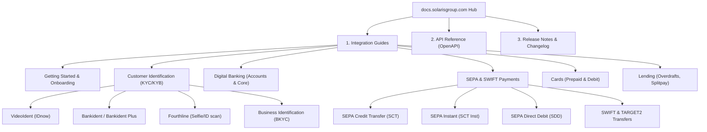

# Solarisbank Integration Analysis & Gaps Report

This report evaluates the current Solarisbank integration in the **Typhoon Banking Platform** against the developer guides on `docs.solarisgroup.com` and the incoming TARGET2 transfers documentation ([target2-transfers.md](file:///c:/Users/User/Herd/typhoon/target2-transfers.md)).

---

## 1. Solarisbank Developer Documentation Structure

The official Solaris Developer Hub (`docs.solarisgroup.com`) organizes integration guides and API specifications into the following main hierarchies:



### Main Headings & Focus Areas
1. **Getting Started:** Explains the onboarding journey, sandbox environment configurations (`https://api.sandbox.solarisbank.de`), and client credential authentication via OAuth 2.0.
2. **Customer Identification:** Covers automated/agent-assisted KYC processes required for regulatory compliance prior to opening accounts.
3. **Digital Banking:** Details accounts lifecycle management (opening, balances, statements, closures).
4. **Payments:** Focuses on SEPA transfer schemes (Credit Transfer, Instant Credit, Direct Debit) and cross-border SWIFT/TARGET2 payments.
5. **Cards:** Details Visa and Mastercard card issuance, spending limits, and Strong Customer Authentication (SCA) including 3D Secure (3DS).

---

## 2. Comparative Analysis: Docs vs. Current Adapter

The local adapter implementation resides in [SolarisbankAdapter.php](file:///c:/Users/User/Herd/typhoon/app/Services/Baas/SolarisbankAdapter.php) and is wrapped by [BaasService.php](file:///c:/Users/User/Herd/typhoon/app/Services/BaasService.php).

| Section / Capability | Docs Specification | Local Implementation | Alignment Status |
| :--- | :--- | :--- | :---: |
| **Authentication** | OAuth 2.0 `/oauth/token` via `client_credentials` | Handled via cached client credentials in `getAccessToken()` | ✅ Fully Aligned |
| **SEPA Credit Transfer** | POST `/v1/persons/{person_id}/accounts/{account_id}/transactions/sepa_credit_transfer` | Implemented in `initiateCreditTransfer()` with required body payload mapping | ✅ Fully Aligned |
| **SEPA Direct Debit** | POST `/v1/persons/{person_id}/accounts/{account_id}/transactions/sepa_direct_debit` | Implemented in `initiateDirectDebit()` | ✅ Fully Aligned |
| **Transfer Status Check** | GET `/v1/transfers/{external_id}` | Implemented in `fetchTransferStatus()` | ✅ Fully Aligned |
| **Webhook Processing** | Event listener for `MUTATION_BOOK` events | Normalizes `MUTATION_BOOK` to standard completion/failure states in [ProcessWebhookEvent.php](file:///c:/Users/User/Herd/typhoon/app/Jobs/ProcessWebhookEvent.php) | ✅ Fully Aligned |

---

## 3. Key Integration Gaps

The comparative analysis reveals several critical functional gaps that must be resolved to achieve full production readiness:

> [!WARNING]
> **1. Cards Integration is Missing**
> The codebase has zero implementation for issuing cards, managing spending controls, card-present transactions, or 3DS webhook handling, although the PRD outlines POS capabilities. 

> [!IMPORTANT]
> **2. KYC/KYB Integration Gaps**
> The local registration flow supports document uploads to standard file storage via [KycService.php](file:///c:/Users/User/Herd/typhoon/app/Services/KycService.php), but it lacks API connection to Solarisbank's identity methods (such as Fourthline or VideoIdent).

> [!NOTE]
> **3. SEPA Instant (SCT Inst)**
> While SEPA Credit Transfers are implemented, there is no support for Instant SEPA transfers (which requires different limits and Verification of Payee checks).
>
> **4. Account Lifecycle Management**
> Creation of accounts and persons on Solarisbank's ledger is missing; local users and accounts must have their `solaris_person_id` and `solaris_account_id` seeded or pre-configured rather than generated dynamically.

---

## 4. Deep Dive: TARGET2 Transfers Integration

According to [target2-transfers.md](file:///c:/Users/User/Herd/typhoon/target2-transfers.md), Solarisbank supports incoming TARGET2 transfers routed via correspondent banks and settled in Euro.

### How Incoming TARGET2 Webhooks Arrive
Solaris represents these transfers using the booking type `TARGET2_CREDIT_TRANSFER` inside `MUTATION_BOOK` webhook events or account booking queries.

A typical incoming webhook payload looks like this:
```json
{
  "id": "evt_target2_9999",
  "event_type": "MUTATION_BOOK",
  "resource_id": "tx_target2_external_id",
  "resource_type": "sepa_credit_transfer",
  "payload": {
    "id": "tx_target2_external_id",
    "booking_status": "successful_booking",
    "booking_type": "TARGET2_CREDIT_TRANSFER",
    "charge_details": "SHAR",
    "recipient_iban": "DE89370400440532014001",
    "amount": {
      "value": 15000.00,
      "currency": "EUR"
    },
    "sender_name": "Acme Corp Australia",
    "sender_iban": "AU1234567890",
    "description": "Invoice Payment"
  }
}
```

### Proposed Code Modifications

To support incoming TARGET2 transfers properly, [ProcessWebhookEvent.php](file:///c:/Users/User/Herd/typhoon/app/Jobs/ProcessWebhookEvent.php) needs to be updated.

#### Step 1: Detect `TARGET2_CREDIT_TRANSFER` and Extract Metadata
We must capture the `booking_type` and `charge_details` and store them in the transaction's metadata field. This allows compliance officers and users to identify the payment rail and fee structure.

#### Step 2: Code Integration Plan

```diff
  // Normalize Solarisbank webhook payloads (MUTATION_BOOK events) to standard format
  if (isset($payload['event_type']) && $payload['event_type'] === 'MUTATION_BOOK') {
      $solarisPayload = $payload['payload'] ?? [];
      $status = $solarisPayload['status'] ?? $solarisPayload['booking_status'] ?? 'completed';
      
      if (in_array($status, ['successful', 'successful_booking', 'completed', 'booked'])) {
          $status = 'completed';
      } elseif (in_array($status, ['failed', 'rejected', 'returned'])) {
          $status = 'failed';
      }
  
+     $bookingType = $solarisPayload['booking_type'] ?? null;
+     $chargeDetails = $solarisPayload['charge_details'] ?? null;
+ 
      $payload = [
          'external_id' => $payload['resource_id'] ?? $solarisPayload['id'] ?? null,
          'status' => $status,
          'failure_reason' => $solarisPayload['description'] ?? $solarisPayload['failure_reason'] ?? 'Solarisbank mutation booking failed',
+         'booking_type' => $bookingType,
+         'charge_details' => $chargeDetails,
      ];
      
      $this->event->event_type = 'transfer';
  }
```

Then, in the `processPaymentEvent` method:
```diff
  $tx = $transactionService->deposit(
      $account, 
      $amount, 
-     'bank_transfer', 
+     $payload['booking_type'] === 'TARGET2_CREDIT_TRANSFER' ? 'target2_transfer' : 'bank_transfer', 
      $externalId
  );
  
  $tx->update([
      'description' => $description,
      'metadata' => array_merge($tx->metadata ?? [], [
          'baas_external_id' => $externalId,
          'sender_name' => $senderName,
          'sender_iban' => $originalPayload['sender_iban'] 
              ?? $originalPayload['debtor_iban'] 
              ?? $solarisPayload['sender_iban'] 
              ?? $solarisPayload['debtor_iban'] 
              ?? null,
+         'booking_type' => $payload['booking_type'] ?? null,
+         'charge_details' => $payload['charge_details'] ?? null,
      ])
  ]);
```

---

## 5. Next Steps & Recommended Action Plan

To fully bridge the gaps between Solarisbank specifications and the Typhoon Platform:

1. **Implement Dynamic Person & Account Creation:**
   - Update `BaasService` with `createPerson(array $params)` and `createAccount(array $params)` endpoints mapped to Solaris' customer onboarding and bank accounts API.
2. **Incorporate TARGET2 Payload Enhancements:**
   - Apply the proposed diff to `ProcessWebhookEvent` to capture `booking_type` and `charge_details` for all incoming mutation events.
3. **Design Card Servicing Layer:**
   - Create a `CardService` and `SolarisbankCardAdapter` supporting cards creation (POST `/v1/cards`), PIN setting, and card status checks.
4. **Implement Live KYC Handshake:**
   - Integrate VideoIdent and Fourthline SDK webhook hooks to automatically advance users' KYC levels locally when verification completes on Solaris' side.
